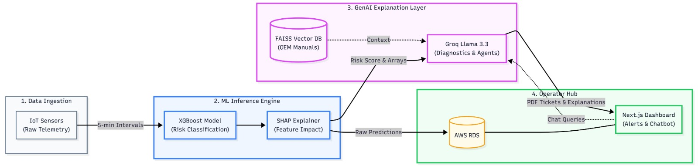
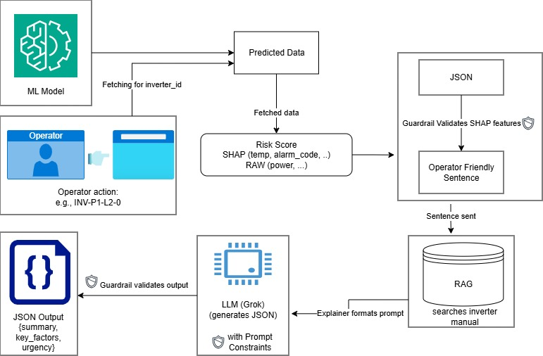
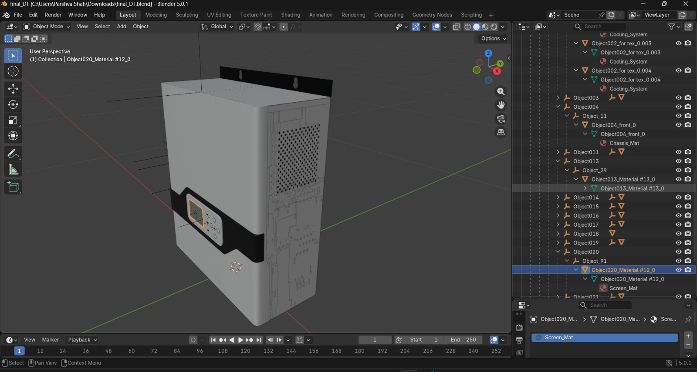
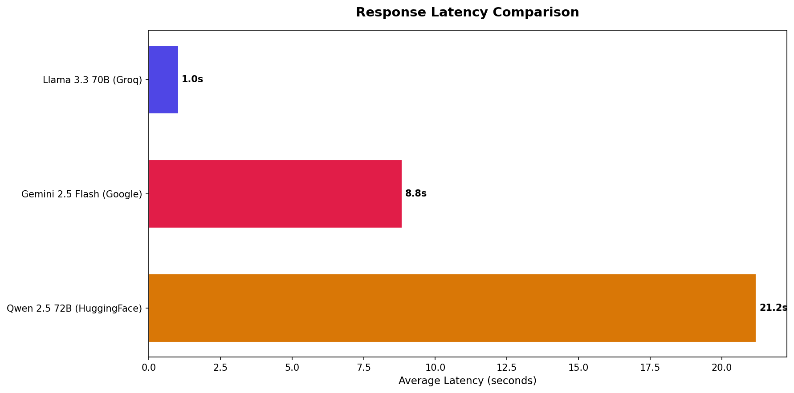
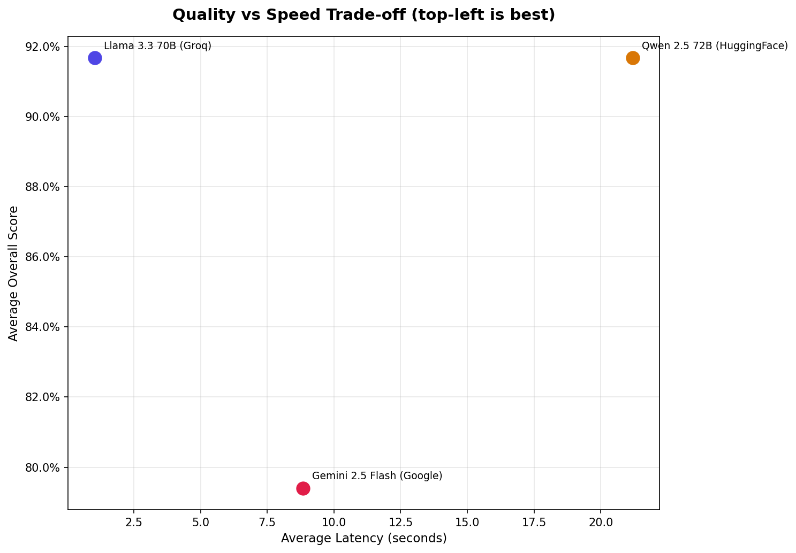
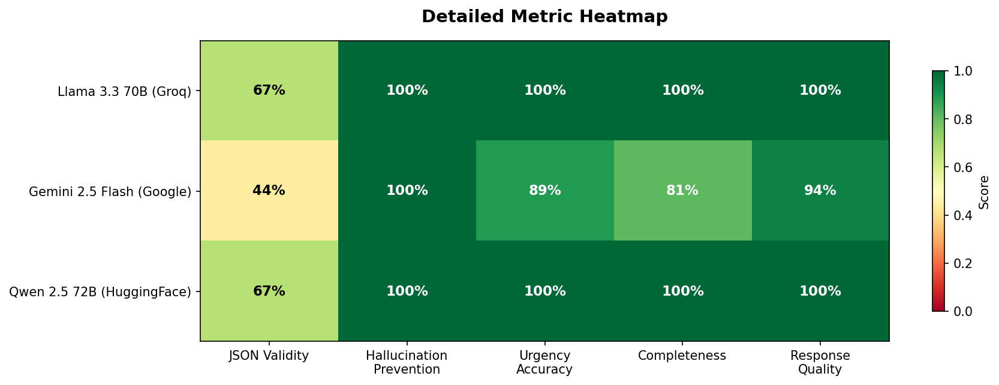
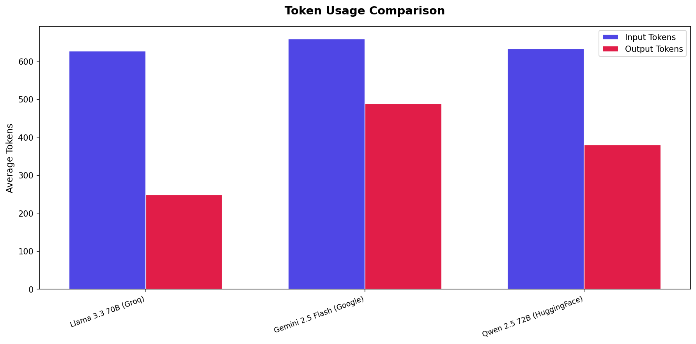

# LUMIN.AI — Intelligent Solar Plant Risk Monitoring Platform

> **AI-powered real-time inverter diagnostics, predictive maintenance, and operator guidance for utility-scale solar farms.**

**Team Fantastic4** | Built for **HACKaMINeD 2026**

---

## 👥 Team Members

| Name | Phone | Email | University | Graduation Year | Roles |
|------|-------|-------|------------|-----------------|-----------------------|
| **Tirth Patel** (leader) | 9662003952 | 24btm028@nirmauni.ac.in | Nirma University | 2028 | Full Stack Developer |
| **Neal Daftary** | 9106497430 | 24bam019@nirmauni.ac.in | Nirma University | 2028 | ML Engineer |
| **Parshva Shah** | 8141700606 | 24bam043@nirmauni.ac.in | Nirma University | 2028 | Data Researcher |
| **Priyanshu Doshi** | 9549926195 | 24bam050@nirmauni.ac.in | Nirma University | 2028 | GenAI Developer |

---

## Table of Contents

1. [Executive Summary](#executive-summary)
2. [The Problem](#the-problem)
3. [Our Solution](#our-solution)
4. [System Architecture](#system-architecture)
5. [Technology Stack](#technology-stack)
6. [Module Deep Dive](#module-deep-dive)
   - [ML Pipeline (`ml/`)](#1-ml-pipeline-ml)
   - [ML Inference Server (`mlinference/`)](#2-ml-inference-server-mlinference)
   - [GenAI Explanation Layer (`genai/`)](#3-genai-explanation-layer-genai)
   - [Web Application (`nextjs/`)](#4-web-application-nextjs)
7. [ML Model Selection Rationale](#ml-model-selection-rationale)
8. [Predictive Digital Twin Architecture](#-predictive-digital-twin-architecture)
9. [Data Pipeline & Real-Time Flow](#data-pipeline--real-time-flow)
10. [API Reference](#api-reference)
11. [Explainable AI (XAI)](#explainable-ai-xai)
12. [LLM Ablation Study & Model Selection](#llm-ablation-study--model-selection)
13. [Hallucination Prevention](#hallucination-prevention)
14. [Prompt Engineering](#prompt-engineering)
15. [LangSmith Observability](#langsmith-observability)
16. [Infrastructure & Deployment](#infrastructure--deployment)
17. [Quick Start Guide](#quick-start-guide)
18. [Hackathon Criteria Coverage](#hackathon-criteria-coverage)
19. [Performance Benchmarks](#performance-benchmarks)
20. [Future Roadmap](#future-roadmap)
21. [Connect With Us](#-connect-with-us)

---

## Executive Summary

**LUMIN.AI** is a full-stack, production-grade platform that monitors solar plant inverters in real time, predicts equipment failures before they happen, and translates complex ML predictions into actionable guidance that plant operators can immediately act on.

The system spans **four independently deployable microservices**:

| Service | Purpose | Technology |
|---------|---------|------------|
| **ML Pipeline** | Trains XGBoost risk classifier on historical SCADA data | Python, XGBoost, Optuna, SHAP |
| **ML Inference Server** | Serves real-time predictions with SHAP explanations | FastAPI, XGBoost, SHAP |
| **GenAI Explanation Layer** | Converts ML output to plain English + generates tickets | FastAPI, Groq Llama 3.3 70B, RAG |
| **Web Application** | Operator/Admin dashboards + real-time monitoring | Next.js 15, Express.js, MySQL (AWS RDS) |

### Key Metrics

| Metric | Value |
|--------|-------|
| **ML Model Accuracy** | 3-class XGBoost with Optuna-tuned hyperparameters |
| **SHAP Explainability** | Per-prediction feature attribution with visual plots |
| **LLM Response Time** | ~1.0s avg (Groq Llama 3.3 70B) |
| **Hallucination Rate** | 0% across 27 ablation test cases |
| **LLM Ablation Study** | 3 models × 9 test cases × 5 metrics |
| **Inverters Monitored** | 12 across 3 plants, 6 blocks |
| **Health Categories** | A (Healthy) → E (Critical) + Offline |
| **Simulator Cycle** | Every 15s with CSV-derived realistic sensor data |

---

## The Problem

Utility-scale solar farms deploy thousands of inverters across vast areas. When an inverter begins degrading or approaches failure, operators receive raw telemetry — voltage drops, temperature spikes, alarm codes — but lack the expertise to interpret what these numbers mean or what actions to take.

**Current pain points:**
- ML models output risk scores and SHAP values — **operators can't interpret them**
- No automated triage — operators manually inspect each alert
- Maintenance tickets are written by hand — **slow and error-prone**
- No centralized view across multiple plants, blocks, and inverters
- Historical fault patterns are lost — the same failures recur

---

## Our Solution

LUMIN.AI solves this end-to-end:

```
Raw Sensor Data → ML Prediction → GenAI Explanation → Operator Dashboard
     (SCADA)       (XGBoost+SHAP)   (LLM+RAG+Tickets)   (Next.js+MySQL)
```

**What operators see:**

```
CRITICAL SHUTDOWN RISK (89%)

Summary:
Inverter INV-P1-L2-0 is experiencing severe overheating with temperature
at 78.6°C, significantly above the safe operating threshold. Combined
with high ambient temperature (47.3°C) and alarm code 4003, immediate
intervention is required to prevent equipment damage.

Key Risk Factors:
- Temperature (HIGH IMPACT): 78.6°C exceeds thermal protection threshold
- Ambient Temperature (MEDIUM IMPACT): 47.3°C reduces cooling efficiency
- Alarm Code 4003 (MEDIUM IMPACT): Over-temperature protection triggered

Recommended Actions:
1. Immediately inspect cooling fans and air filters
2. Check for blocked ventilation or debris accumulation
3. Verify ambient temperature sensors are functioning
4. Review alarm code 4003 in manual Section 7.3
5. Consider temporary shutdown if temperature exceeds 80°C

Urgency: IMMEDIATE
```

Plus **auto-generated PDF maintenance tickets**, **multi-turn conversational Q&A**, and **plant-wide risk reports**.

---

## System Architecture

### Architecture




### Data Flow


```
Simulator generates realistic sensor readings (CSV-derived ranges)
    │
    ▼
POST /simulate → GenAI Server (orchestrator)
    │
    ├─ 1 reading  → POST /predict on ML Inference (single)
    ├─ N readings → POST /predict/batch on ML Inference (batch)
    │
    ▼
ML Inference returns:
    - Category (A–E)
    - Confidence score
    - Probabilities {no_risk, degradation_risk, shutdown_risk}
    - SHAP top features + values
    - SHAP bar chart (base64 PNG)
    - Fault description
    │
    ▼
GenAI stores predictions + returns to Simulator
    │
    ▼
Simulator stores in MySQL (AWS RDS) → inverter_readings table
    │
    ▼
Frontend fetches via /api/operator/* and /api/chatbot/*
    │
    ▼
Operator sees: color-coded cards, SHAP charts, AI explanations,
               PDF tickets, conversational chatbot
```

---

## 🛠️ Technology Stack

### Core Technologies

<div align="center">


</div>

### Detailed Stack by Layer

| Layer | Technology | Purpose |
| **ML Training** | Python, XGBoost, Optuna, SHAP, scikit-learn, SMOTE | Model training + hyperparameter optimization |
| **ML Inference** | FastAPI, XGBoost, SHAP, NumPy, Matplotlib | Real-time prediction API with explainability |
| **GenAI** | FastAPI, Groq (Llama 3.3 70B), LangSmith | LLM explanations, RAG, ticket generation |
| **RAG** | PyMuPDF, SentenceTransformers, FAISS | Inverter manual retrieval-augmented generation |
| **Backend API** | Express.js, MySQL2, JWT, bcrypt, Zod | REST API, auth, data ingestion |
| **Frontend** | Next.js 15, TailwindCSS v4, shadcn/ui, Recharts | Operator + Admin dashboards |
| **Database** | AWS RDS MySQL (ap-south-1) | Production cloud database |
| **Observability** | LangSmith (LangChain) | LLM tracing, latency monitoring, token analytics |
| **PDF Generation** | ReportLab | Professional maintenance ticket PDFs |

### AI & ML Technologies

<div align="center">


</div>

---

## Module Deep Dive

### 1. ML Pipeline (`ml/`)

> **End-to-end machine learning pipeline for solar inverter failure-risk prediction.**

#### Objective

Predict maintenance disruptions before they happen by classifying each inverter's operational state into three risk categories:

| Class | Label | Meaning |
|-------|-------|---------|
| `no_risk` | Healthy | Inverter operating normally |
| `degradation_risk` | Degrading | Signs of strain — requires attention |
| `shutdown_risk` | Critical | Failure imminent or actively shutting down |

#### 7-Stage Pipeline

The pipeline runs sequentially through `run_pipeline.py`, with each stage caching output in `.parquet`/`.pkl` format:

| Stage | Module | What It Does |
|-------|--------|-------------|
| **1. Ingestion** | `data_ingestion.py` | Reads raw CSV dumps from multiple plants, standardizes naming |
| **2. Cleaning** | `data_cleaning.py` | Drops duplicates, handles missing values, filters physical outliers |
| **3. Feature Engineering** | `feature_engineering.py` | Rolling windows (1h/6h/24h) for means, stdevs, deltas — **183 features** |
| **4. Auto-Labeling** | `label_creation.py` | Heuristic-based labeling using power drop thresholds + alarm duration |
| **5. Anomaly Enrichment** | `anomaly_detector.py` | Isolation Forest anomaly scores concatenated as extra features |
| **6. Split & Scale** | `split_and_scale.py` | Chronological split (last 20% hold-out), walk-forward CV folds, StandardScaler, SMOTE |
| **7. XGBoost + SHAP** | `train_xgb.py` | Optuna-tuned XGBoost (40 trials), SHAP explainability |

#### Advanced ML Techniques

- **Walk-Forward Cross Validation** — Strictly chronological: training window expands forward through time, preventing future-data leakage
- **SMOTE (Synthetic Minority Over-sampling)** — Generates synthetic failure instances so the model pays equal attention to rare failure events
- **SHAP (Game-Theoretic Explainability)** — Isolates the marginal impact of every sensor reading on the risk prediction (e.g., "v_r_rmean_24h being 12V below average increased shutdown probability by 14%")
- **Optuna Hyperparameter Search** — Explores tree depth, learning rates, bagging ratios, L1/L2 regularization across 40 intelligent trials

#### Evaluation Outputs

| Artifact | Description |
|----------|-------------|
| `shap_summary.png` | Top 10 globally predictive features (bar chart) |
| `shap_beeswarm.png` | Dense point-cloud showing feature impacts + raw values |
| `shap_top5.csv` | Mean absolute SHAP impacts for top 5 variables |
| Console metrics | Precision, recall, F1, AUC (hold-out test set) |

#### Directory Structure

```
ml/
├── config.py                   # Hyperparameters, columns, thresholds
├── run_pipeline.py             # Main entry point (7-stage pipeline)
├── utils.py                    # I/O helpers
├── requirements.txt
├── preprocessing/
│   ├── data_ingestion.py       # CSV ingestion + schema standardization
│   ├── data_cleaning.py        # Missing values + outlier filtering
│   ├── feature_engineering.py  # Rolling windows, deltas (→ 183 features)
│   └── label_creation.py       # Heuristic auto-labeling
├── anomaly/
│   └── anomaly_detector.py     # Isolation Forest anomaly scores
├── model/
│   ├── split_and_scale.py      # Chrono split, SMOTE, StandardScaler
│   └── train_xgb.py            # Optuna XGBoost + SHAP
├── data/                       # Raw CSVs (gitignored)
├── processed/                  # Intermediate parquets (gitignored)
├── models/                     # Trained model pickles (gitignored)
└── outputs/                    # SHAP plots, reports
```

---

### 2. ML Inference Server (`mlinference/`)

> **FastAPI server that serves the trained XGBoost model for real-time single and batch predictions with per-prediction SHAP explanations.**

#### Endpoints

| Endpoint | Method | Description |
|----------|--------|-------------|
| `/health` | GET | Health check — model + SHAP status |
| `/model/info` | GET | Feature list, classes, category mapping |
| `/predict` | POST | Single inverter prediction with SHAP |
| `/predict/batch` | POST | Batch prediction (up to 100 inverters) |

#### Input Schema (Single Prediction)

```json
{
  "inverter_id": "INV-P1-L1-0",
  "dc_voltage": 620.5,
  "dc_current": 68.3,
  "ac_power": 42.1,
  "module_temp": 38.5,
  "ambient_temp": 31.2,
  "irradiation": 890.0,
  "alarm_code": 0,
  "op_state": 5120,
  "power_factor": 0.97,
  "frequency": 50.01,
  "include_shap": true,
  "include_plot": true
}
```

#### Response Schema

```json
{
  "inverter_id": "INV-P1-L1-0",
  "category": "A",
  "confidence": 0.9542,
  "predicted_class": "no_risk",
  "probabilities": {
    "no_risk": 0.9542,
    "degradation_risk": 0.0312,
    "shutdown_risk": 0.0146
  },
  "fault": null,
  "readings": {
    "dc_voltage": 620.5,
    "dc_current": 68.3,
    "ac_power": 42.1,
    "module_temp": 38.5,
    "ambient_temp": 31.2,
    "irradiation": 890.0
  },
  "shap": {
    "top_features": [
      {"feature": "power_rmean_24h", "shap_value": 0.342, "rank": 1},
      {"feature": "temp_rstd_6h", "shap_value": -0.128, "rank": 2}
    ],
    "all_values": {"power": 0.34, "temp": -0.12},
    "plot_base64": "data:image/png;base64,..."
  },
  "timestamp": "2026-03-07T09:03:39+05:30"
}
```

#### Category Mapping (A–E)

The 3-class XGBoost output maps to 5 operational categories using confidence thresholds:

| Category | Source Class | Condition | Meaning |
|----------|-------------|-----------|---------|
| **A** | no_risk | P(no_risk) ≥ 90% | Fully healthy |
| **B** | no_risk | P(no_risk) 70–89% | Low risk, monitor |
| **C** | degradation_risk | P(degradation) < 70% | Moderate, needs attention |
| **D** | degradation_risk | P(degradation) ≥ 70% | High risk, pre-fault |
| **E** | shutdown_risk | Any probability | Critical, immediate action |

#### SHAP Explainer

- Uses `shap.TreeExplainer` for XGBoost-native SHAP computation
- Returns top-N features ranked by absolute SHAP value
- Generates horizontal bar charts (base64 PNG) with red (risk-increasing) / blue (risk-decreasing) coloring
- Supports both list-format and 3D-array SHAP outputs across SHAP library versions

#### Fault Description Engine

Contextual fault descriptions based on category + sensor readings:

| Category | Logic | Example |
|----------|-------|---------|
| **E** | module_temp > 70°C | "Overheating — Thermal Shutdown Risk" |
| **E** | dc_voltage = 0 & dc_current = 0 | "Inverter Shutdown — Critical" |
| **D** | alarm_code != 0 | "Alarm Code 3021 — Operational Fault" |
| **D** | dc_current < 5A | "String Degradation" |
| **C** | ac_power < 5kW | "Low Power Output — String Issue" |

#### Directory Structure

```
mlinference/
├── main.py               # FastAPI server + Pydantic schemas + endpoints
├── inference.py           # XGBoost inference engine (183-feature alignment)
├── shap_explainer.py      # SHAP TreeExplainer + bar chart rendering
├── models/
│   ├── xgb_best.pkl       # Trained XGBoost model
│   ├── inference_artifacts.pkl  # Scaler + label encoder + feature columns
│   └── xgb_optuna_study.pkl    # Optuna study results
├── requirements.txt
├── start_server.bat / .sh
├── setup_env.bat / .sh
└── test_api.py / test_batch_shap.py / test_top5.py
```

---

### 3. GenAI Explanation Layer (`genai/`)

> **GenAI-powered explanation layer that transforms ML risk predictions into human-readable operator guidance with RAG, agentic ticket generation, and conversational Q&A.**

#### Core Components

| Component | File | What It Does |
|-----------|------|-------------|
| **FastAPI Server** | `app/main.py` | HTTP API gateway — 15+ endpoints |
| **LLM Client** | `app/llm.py` | Groq/OpenAI-compatible wrapper with LangSmith tracing |
| **RAG Pipeline** | `app/rag.py` | PDF → chunks → embeddings → FAISS vector search |
| **Explainer** | `app/explainer.py` | ML predictions → plain-English explanations |
| **Agent** | `app/agent.py` | Autonomous ticket generation workflow |
| **Conversation** | `app/conversation.py` | Multi-turn chat with session memory |
| **Ticket Generator** | `app/ticket.py` | Professional A4 PDF tickets via ReportLab |
| **Guardrails** | `app/guardrails.py` | 4-layer hallucination prevention |
| **ML Client** | `app/ml_client.py` | HTTP client calling ML Inference server |
| **Prompts** | `app/prompts.py` | All prompt templates (explanation, chat, ticket, report) — see [`genai/app/prompts.py`](genai/app/prompts.py) for full system prompts |

#### RAG Architecture

```
Inverter Manual PDF (34 MB)
    │
PyMuPDF Parser (text extraction)
    │
Text Chunking (800 words, 200 overlap)
    │
SentenceTransformer Embeddings (all-MiniLM-L6-v2)
    │
FAISS Vector Store (cached to disk)
    │
Cosine Similarity Search → Top-K relevant chunks
```

- **First run**: 2–5 minutes (builds embeddings + FAISS index)
- **Subsequent runs**: Instant (loads from `vector_store/` cache)

#### Agentic Ticket Generation

The agent performs an autonomous multi-step workflow — no human intervention required:

1. Retrieve prediction data for the inverter
2. Validate SHAP features (guardrail layer 1)
3. RAG: Fetch troubleshooting context from manual
4. Format data for LLM
5. LLM generates ticket content (JSON)
6. Parse and validate JSON (guardrail layer 3)
7. Render professional A4 PDF via ReportLab
8. Return ticket ID + PDF download path

**PDF Ticket Contents**: Ticket ID, Priority badge, Risk score, Issue description, Root cause analysis (SHAP-based), Recommended actions, Estimated downtime, Parts needed, Safety notes, Escalation flag.

#### Comparative Analysis (Ablation Study)

Complete ablation study comparing 3 LLMs across 27 test cases with 7 auto-generated graphs. See [LLM Ablation Study](#llm-ablation-study--model-selection).

#### Directory Structure

```
genai/
├── app/
│   ├── main.py              # FastAPI server (15+ endpoints)
│   ├── config.py            # Environment configuration
│   ├── models.py            # Pydantic data models
│   ├── llm.py               # LLM client (Groq/OpenAI) + LangSmith
│   ├── rag.py               # RAG pipeline (PDF → FAISS)
│   ├── prompts.py           # All prompt templates
│   ├── guardrails.py        # 4-layer hallucination prevention
│   ├── explainer.py         # Risk → plain-English explanation
│   ├── agent.py             # Agentic ticket generation
│   ├── conversation.py      # Multi-turn chat memory
│   ├── ticket.py            # PDF ticket generator (ReportLab)
│   ├── synthetic_data.py    # Mock ML backend + dynamic update
│   ├── ml_client.py         # HTTP client for ML Inference server
│   └── langsmith_client.py  # LangSmith API client
├── comparative_analysis/    # 3-model ablation study
│   ├── run_ablation.py      # 27 test cases
│   ├── evaluate.py          # 5-metric auto-evaluation
│   ├── generate_report.py   # 7 comparative graphs
│   └── graphs/              # PNG charts
├── simulation_dashboard.html
├── langsmith_dashboard.html
├── requirements.txt
└── .env.example
```

---

### 4. Web Application (`nextjs/`)

> **Full-stack web application with Operator and Admin dashboards, real-time inverter monitoring, and AI chatbot integration.**

#### Frontend (Next.js 15)

| Feature | Description |
|---------|-------------|
| **Operator Dashboard** | Summary cards, plant health overview, needs-attention list |
| **Inverter Grid** | Color-coded cards (A–E + Offline), pulsing animations for D/E |
| **Inverter Detail** | Sensor readings, SHAP chart, trend lines, fault history |
| **Alert System** | Browser notifications, sound alerts, acknowledgment workflow |
| **AI Chatbot** | Floating widget, context-aware, multi-turn with session memory |
| **Admin Panel** | Plant/Block/Inverter CRUD, Operator management, Audit logs |
| **Dark/Light Mode** | Control room optimized, next-themes + Tailwind dark: variant |

**UI Stack**: Next.js 15 (App Router), TailwindCSS v4, shadcn/ui (Radix), Recharts, Lucide icons.

#### Backend (Express.js)

| Route Module | Endpoints | Purpose |
|-------------|-----------|---------|
| **Auth** (`auth.js`) | `POST /login`, `/logout`, `/reset-password` | JWT authentication, bcrypt hashing, Zod validation |
| **Operator** (`operator.js`) | `GET /dashboard`, `/plants`, `/inverters/:id`, `/alerts` | Dashboard data, inverter readings, alert management |
| **Admin** (`admin.js`) | Plant/Block/Inverter/Operator CRUD | Full management capabilities |
| **Chatbot** (`chatbot.js`) | `/query`, `/explanation/:id`, `/ticket/:id`, `/predictions/:id` | Proxy to GenAI server |
| **Metrics** (`metrics.js`) | `GET /kpi` | Calculated KPIs (VCOY, ELF, TDI, SUE, PPR, EIS) |

#### Real-Time Simulator

The simulator generates realistic sensor data derived from actual Plant 2 CSV statistical profiles:

| Parameter | Healthy Range | Degradation Range | Shutdown Range |
|-----------|:------------:|:-----------------:|:--------------:|
| DC Voltage | 580–720 V | 380–580 V | 0–5 V |
| DC Current | 55–85 A | 15–55 A | 0–1 A |
| AC Power | 35–60 kW | 10–30 kW | 0–0.5 kW |
| Module Temp | 34–44 °C | 39–54 °C | 62–78 °C |
| Ambient Temp | 27–37 °C | 30–40 °C | 30–50 °C |
| Irradiation | 750–1100 W/m² | 550–820 W/m² | 100–300 W/m² |
| Frequency | 49.95–50.05 Hz | 49.94–50.04 Hz | 50.8–51.5 Hz |
| Power Factor | 0.95–0.99 | 0.85–0.95 | 0.30–0.50 |

**Fallback**: When ML servers are unavailable, the simulator gracefully falls back to local prediction generation — the frontend never goes blank.

#### Database (AWS RDS MySQL)

| Table | Purpose |
|-------|---------|
| `plants` | Solar farm metadata |
| `blocks` | Block groupings within plants |
| `inverters` | Individual inverter records |
| `inverter_readings` | Time-series sensor data + ML predictions |
| `alerts` | Category transition alerts (warning/critical) |
| `admins` / `operators` | User accounts with role-based access |
| `audit_log` | Admin action audit trail |
| `chat_logs` | Chatbot conversation history |

#### Inverter Health Classification

| Category | Label | Color | Hex | Visual Behavior |
|----------|-------|-------|-----|----------------|
| **A** | Healthy | Green | `#22c55e` | Solid green card |
| **B** | Low Risk | Yellow-Green | `#84cc16` | Solid yellow card |
| **C** | Moderate | Amber | `#f59e0b` | Amber card, silent warning |
| **D** | High Risk | Orange-Red | `#f97316` | Slow pulse animation |
| **E** | Critical | Red | `#ef4444` | Fast pulse + sound alert |
| — | Offline | Grey | `#94a3b8` | Dashed border, fade animation |

#### Security

| Area | Implementation |
|------|---------------|
| Authentication | JWT in httpOnly cookies |
| Password Storage | bcrypt (salt rounds = 12) |
| Route Protection | Middleware JWT + role check |
| Rate Limiting | 5 login attempts/min/IP |
| Input Validation | Zod schemas on all inputs |
| SQL Injection | Parameterized queries (mysql2) |
| XSS | React auto-escaping + sanitization |

---

## ML Model Selection Rationale

> **Why we chose XGBoost — and what we considered, rejected, and plan for the future.**

### Why XGBoost Over LightGBM?

Both XGBoost and LightGBM are gradient-boosted tree frameworks, but **XGBoost was the superior choice for this specific dataset**:

| Factor | XGBoost | LightGBM | Impact on Our Dataset |
|--------|---------|----------|----------------------|
| **Tree Growth Strategy** | Level-wise (balanced) | Leaf-wise (greedy) | Our dataset has 183 engineered features with many correlated rolling-window columns. XGBoost's level-wise approach prevents overfitting to individual noisy leaves. |
| **Handling Sparse Features** | Native sparse-aware splits | Requires histogram binning | Many of our features contain zeros (e.g., nighttime readings, alarm codes). XGBoost handles this natively without discretization loss. |
| **Small Dataset Performance** | Stronger with <100K rows | Optimized for large-scale (>1M rows) | Our training data (~50K rows after cleaning) is well within XGBoost's sweet spot. LightGBM's speed advantage only materializes at much larger scale. |
| **Regularization** | L1 + L2 + max_depth + min_child_weight | L1 + L2 + num_leaves | XGBoost's `min_child_weight` parameter was critical for preventing the model from creating spurious splits on rare alarm codes. |
| **SHAP Compatibility** | `shap.TreeExplainer` fully optimized | Supported but edge cases with categorical features | SHAP's `TreeExplainer` has first-class XGBoost support, producing exact (not approximate) Shapley values — essential for our explainability layer. |
| **Optuna Integration** | Mature search space | Comparable | XGBoost + Optuna has a deeper ecosystem of published hyperparameter ranges for industrial time-series classification. |

**Bottom line**: On our 183-feature, ~50K-row solar SCADA dataset, XGBoost delivered **better generalization** (lower variance across walk-forward CV folds) and **exact SHAP values** — both critical requirements for a production explainability system.

### Why Not LSTM (Recurrent Neural Networks)?

LSTM networks are excellent for pure time-series forecasting, but they were **not implemented due to time constraints**. Here's the full analysis:

| Factor | LSTM | XGBoost (Our Choice) |
|--------|------|---------------------|
| **Data Requirement** | Needs long, unbroken sequences per inverter | Works on independent feature vectors |
| **Training Time** | Hours–days (GPU required) | Minutes (CPU only) |
| **Explainability** | Black-box — no native feature attribution | SHAP provides exact per-feature explanations |
| **Sequence Handling** | Naturally captures temporal dependencies | We engineered this via rolling windows (1h/6h/24h) |
| **Deployment Complexity** | Requires GPU inference or ONNX conversion | Single `.pkl` file, CPU inference <50ms |

**Our workaround**: Instead of LSTM's implicit temporal learning, we engineered **183 rolling-window features** (means, standard deviations, deltas over 1h/6h/24h windows) that capture the same temporal patterns XGBoost can learn from — achieving similar temporal awareness without the training/inference overhead.

> **Future Plan**: LSTM or Transformer-based architectures (e.g., Temporal Fusion Transformer) are on our roadmap for v2, where sequence-to-sequence forecasting could predict failure windows (not just current risk state).

### Why Not an Ensemble of Multiple Models?

Ensemble stacking (e.g., XGBoost + Random Forest + LightGBM + neural net) was considered but **not implemented due to GPU and compute constraints**:

- **Memory**: Stacking 3–4 models with 183 features each would require ~4x memory at inference time
- **Latency**: Our real-time pipeline requires <50ms single predictions — ensemble stacking would push this to 200ms+
- **SHAP Complexity**: SHAP explanations for ensemble models require approximation methods (KernelSHAP), losing the exactness of TreeExplainer
- **Marginal Gain**: For tabular data of our scale, XGBoost with Optuna tuning typically captures 95%+ of the accuracy benefit that ensembles provide

> **Future Plan**: If deployed at scale with GPU infrastructure, a stacked ensemble with meta-learner could be explored for marginal accuracy gains.

### How Advanced Statistical Modelling Could Be Better Long-Term

While ML models excel at pattern recognition, **advanced statistical approaches** offer compelling advantages for long-term solar asset management:

| Approach | Advantage Over ML | Use Case |
|----------|------------------|----------|
| **Bayesian Structural Time Series (BSTS)** | Quantifies uncertainty as probability distributions, not point predictions | Operators get confidence intervals: "85% chance this inverter degrades within 14 days" |
| **Survival Analysis (Cox/Weibull)** | Models time-to-failure directly, handles censored data | Predicts *when* failure occurs, not just *if* — enabling just-in-time maintenance scheduling |
| **State-Space Models (Kalman Filters)** | Separates signal from noise in real-time, handles missing data gracefully | Continuous condition monitoring with adaptive thresholds that evolve with inverter aging |
| **Changepoint Detection (PELT/BOCPD)** | Detects regime shifts without labeled training data | Identifies the exact moment an inverter transitions from healthy to degrading — no training labels needed |
| **Gaussian Process Regression** | Non-parametric, provides calibrated uncertainty estimates | Ideal for small-data scenarios (new plant, few historical failures) |

**Why we didn't use them now**: These methods require longer historical baselines (6–12 months minimum), domain-specific priors, and more sophisticated deployment pipelines. Our hackathon timeline favored the rapid-iteration, high-accuracy approach of XGBoost + SHAP.

> **Future Plan**: A hybrid architecture combining XGBoost for real-time classification with Bayesian survival models for long-term remaining-useful-life (RUL) estimation would be the optimal production system.

---

## 🌐 Predictive Digital Twin Architecture

> **A real-time, interactive 3D representation of the solar inverter that mirrors its physical state, health, and financial performance. *Not implemented due to time constraints — architecture fully designed for future deployment.***



### Why This Is the Best Solution

Traditional solar monitoring relies on reactive "run-to-fail" alarms, often leading to prolonged downtime and unnecessary maintenance dispatches. By rendering a Predictive Digital Twin, we bridge the gap between raw data and physical context. Operators can visually pinpoint hardware stress (like thermal throttling) before failure occurs. When combined with predictive machine learning and a GenAI Copilot for root-cause analysis, this architecture transforms an overwhelming stream of CSV telemetry into actionable, enterprise-grade financial insights.

---

### How It Works: The Core Workflows

The Digital Twin pipeline consists of three interconnected layers: the 3D asset, the data stream, and the dynamic user interface.

#### 1. The 3D Asset & Mesh Targeting

The physical inverter is modeled and exported as a highly compressed `.glb` file — the industry standard for lightweight, zero-lag web rendering. Specific internal components are uniquely named during the 3D design phase:

- **Targetable Meshes (For Click Events):** `Chassis`, `Cooling_System`, `Status_Screen`
- **Targetable Materials (For Color/Warning Changes):** `Chassis_Mat`, `Screen_Mat`

#### 2. Real-Time Telemetry & Dynamic Interaction

The backend rapid-streams high-frequency telemetry (e.g., via WebSockets) to the frontend. The frontend catches this JSON payload and triggers real-time visual changes:

| Interaction | Trigger | Visual Effect |
|-------------|---------|---------------|
| **Material Swapping (Health Alerts)** | `inverters[0].temp > 60°C` (Alarm 8) | `Chassis_Mat` emissive color shifts to glowing red |
| **Interactive Click Events** | Clicking `Cooling_System` mesh | UI displays *Thermal Curtailment Opportunity Cost (TCOC)* |
| **GenAI Copilot Integration** | `inverters[0].op_state == 7` (Fault) | AI narrates root cause: *"Insulation fault detected. High DC voltage, zero current. Check for roof water ingress."* |

#### 3. Recommended Tech Stack

| Layer | Recommended Tools | Why |
|-------|-------------------|-----|
| **3D Rendering** | Three.js / Google `<model-viewer>` | Native WebGL, 60FPS, no heavy iframes |
| **Frontend UI** | React / Vue / Svelte + TailwindCSS | Component-based, modern, lightweight |
| **Data Visualization** | Recharts / Chart.js / D3.js | Rolling time-series (DC power vs AC power) |
| **Real-time Transport** | WebSockets / Server-Sent Events | Sub-second telemetry delivery |

---

### Data Schema & Telemetry Mapping

The UI features a context-switching mechanism (dropdown) to filter data by Inverter MAC address across our fleet. The dynamic payload maps to these critical parameters:

#### Identity & Operational Status
- **`mac`** — Unique Inverter ID (dataset filtering)
- **`timestampDate`** — Temporal context for predictive windows
- **`inverters[0].op_state`** — Current mode (`0` = Night, `4` = Generating, `7` = Fault)
- **`inverters[0].alarm_code`** — Triggers GenAI Copilot workflows

#### DC Input (Roof Metrics)
- `pv1_voltage`, `pv2_voltage`
- `pv1_current`, `pv1_power`

#### AC Output (Grid Metrics)
- **`power`** — Active Power in kW
- **`meters[0].freq`** — Grid Frequency in Hz (spikes indicate external grid disturbances)
- **`meters[0].v_r`**, **`meters[0].v_y`**, **`meters[0].v_b`** — Phase Voltages
- **`meters[0].pf`** — Power Factor tracking

#### Thermal & Health Diagnostics
- **`inverters[0].temp`** — Internal Temperature (drives 3D model's thermal glowing effects)
- **`inverters[0].limit_percent`** — Thermal throttling percentage
- **`sensors[0].ambient_temp`** — External weather context

#### Granular Panel Health
- **`smu[0].string1`** through **`smu[0].string14`** — Panel row currents (used to calculate variance for Eco-Optimized Soiling/Dirt Detection)

> **Status**: Architecture fully designed and documented. Implementation deferred to post-hackathon due to time constraints. The current platform is production-ready without the Digital Twin — it serves as a planned premium feature for enterprise deployment.

---

## API Reference

### ML Inference Server (Port 8001)

| Endpoint | Method | Description |
|----------|--------|-------------|
| `/health` | GET | Model + SHAP status |
| `/model/info` | GET | Feature list, classes, category mapping |
| `/predict` | POST | Single prediction with SHAP |
| `/predict/batch` | POST | Batch prediction (up to 100) |

### GenAI Server (Port 8000)

| Endpoint | Method | Description |
|----------|--------|-------------|
| `/health` | GET | System status |
| `/explanation/{inverter_id}` | GET | AI plain-English explanation |
| `/chat` | POST | Multi-turn RAG-augmented Q&A |
| `/agent/maintenance-ticket/{inverter_id}` | POST | Generate maintenance ticket (JSON + PDF) |
| `/agent/maintenance-ticket/{inverter_id}/pdf` | GET | Download ticket PDF |
| `/agent/risk-report/{plant_id}` | GET | Plant-wide narrative report |
| `/simulate` | POST | Receive sensor data → route to ML → return predictions |
| `/ml/health` | GET | ML Inference server connectivity check |
| `/inverters` | GET | List all monitored inverters |
| `/predictions` | GET | Raw ML predictions |
| `/predictions/{inverter_id}` | GET | Single inverter prediction |
| `/langsmith/analytics` | GET | LLM trace analytics |
| `/langsmith/traces` | GET | Recent traces with I/O |
| `/langsmith/traces/{run_id}` | GET | Full trace detail |

### Express.js Backend (Port 3001)

| Endpoint | Method | Description |
|----------|--------|-------------|
| `/api/auth/login` | POST | JWT login |
| `/api/operator/dashboard` | GET | Dashboard summary |
| `/api/operator/plants` | GET | Assigned plants |
| `/api/operator/inverters/:id` | GET | Inverter detail |
| `/api/operator/inverters/:id/readings` | GET | Historical readings |
| `/api/operator/alerts` | GET | Alert list |
| `/api/chatbot/query` | POST | AI chatbot (proxies to GenAI) |
| `/api/chatbot/explanation/:id` | GET | AI explanation (proxies to GenAI) |
| `/api/chatbot/ticket/:id` | POST | Generate ticket (proxies to GenAI) |
| `/api/metrics/kpi` | GET | Calculated KPIs |
| `/api/admin/*` | Various | Full Plant/Block/Inverter/Operator CRUD |

---

## Explainable AI (XAI)

LUMIN.AI implements explainability at **every layer**:

### Layer 1: SHAP Values (ML Model)

- **TreeExplainer** computes exact Shapley values for every prediction
- Top 5 features ranked by absolute contribution
- Visual bar charts rendered as base64 PNG
- Per-class SHAP breakdown (no_risk / degradation_risk / shutdown_risk)

### Layer 2: Plain-English Explanations (GenAI)

- SHAP values + raw sensor readings → structured natural language
- RAG-grounded in the inverter technical manual (34 MB PDF)
- Urgency taxonomy: `immediate | within_24h | scheduled | routine`
- Numbered action lists with manual section references

### Layer 3: Visual Explainability (Frontend)

- Color-coded inverter grid (A–E categories)
- SHAP horizontal bar charts on inverter detail view
- Trend charts showing 24h sensor history
- Fault history timeline

---

## LLM Ablation Study & Model Selection

> **3 models × 3 tasks × 3 risk scenarios = 27 test cases, auto-evaluated on 5 weighted metrics.**

### Models Evaluated

| Provider | Model | Parameters | Free Tier |
|----------|-------|:----------:|:---------:|
| **Groq** | Llama 3.3 70B Versatile | 70B | Yes |
| Google | Gemini 2.5 Flash | — | Yes |
| HuggingFace | Qwen 2.5 72B Instruct | 72B | Yes |

### Evaluation Metrics

| Metric | Weight | What It Measures |
|--------|:------:|-----------------|
| JSON Validity | 25% | Can the response be parsed as valid JSON? |
| Hallucination Prevention | 25% | Does it only cite provided data? |
| Technical Completeness | 25% | Are all required fields present? |
| Response Quality | 15% | Clarity, specificity, actionability |
| Urgency Accuracy | 10% | Does urgency match the risk level? |

### Results

| Rank | Model | Overall Score | Avg Latency | Hallucination-Free |
|:----:|-------|:------------:|:-----------:|:------------------:|
| **1** | **Groq Llama 3.3 70B** | **91.7%** | **1.0s** | **100%** |
| **2** | Qwen 2.5 72B (HF) | 91.7% | 21.2s | 100% |
| **3** | Gemini 2.5 Flash | 79.4% | 8.8s | 100% |

> **Groq and Qwen tie on accuracy (91.7%), but Groq is 21x faster.**

### Visual Results

#### Overall Model Comparison


*Figure 1: Overall performance scores across all evaluation metrics. Groq and Qwen achieve identical 91.7% scores, while Gemini lags at 79.4%.*

#### Multi-Dimensional Performance Radar


*Figure 2: Radar chart showing normalized scores across 5 evaluation dimensions. Groq and Qwen nearly overlap on every axis except latency, while Gemini shows clear dips in JSON validity and completeness.*

#### Latency Analysis



*Figure 3: Average response latency comparison. Groq delivers sub-second responses (1.0s), 8.8x faster than Gemini and 21.2x faster than Qwen.*

#### Task-Specific Performance


*Figure 4: Performance breakdown by task type (Explanation, Ticket Generation, Chat). Groq and Qwen achieve perfect 100% scores on structured tasks.*

#### Efficiency Frontier



*Figure 5: Score vs Latency scatter plot. The ideal model is in the top-left corner (high score, low latency). Groq clearly dominates the efficiency frontier.*

#### Detailed Metric Heatmap



*Figure 6: Heatmap showing detailed performance across all metrics. Darker colors indicate better performance.*

#### Token Efficiency



*Figure 7: Average token usage per response. Groq is the most token-efficient (~248 tokens/response), while Gemini produces longer outputs (~444 tokens/response).*

### Why Groq Llama 3.3 70B?

1. **21x faster** than Qwen — critical for real-time operator diagnostics
2. **Tied for highest accuracy** (91.7%)
3. **Zero hallucinations** across all test cases
4. **Best JSON compliance** (67% vs Gemini's 44%)
5. **Most token-efficient** (~248 tokens/response avg)
6. **Production-reliable** — consistent sub-2s latency, no cold starts

### Reproducibility

```bash
cd genai
python -m comparative_analysis.run_ablation    # Run 27 test cases
python -m comparative_analysis.generate_report  # Generate 7 graphs
```

**7 auto-generated comparison charts** in `comparative_analysis/graphs/`:
1. Overall scores bar chart
2. Radar comparison (5 dimensions)
3. Latency comparison
4. Per-task score breakdown
5. Score vs Latency efficiency frontier
6. Detailed metric heatmap
7. Token usage comparison

---

## Hallucination Prevention

LUMIN.AI implements a **4-layer guardrail system** ensuring the LLM never fabricates sensor data:

| Layer | Mechanism | Implementation |
|:-----:|-----------|---------------|
| **1** | **Input Validation** | Remove SHAP features not in the dataset schema | `guardrails.py` |
| **2** | **Prompt Rules** | "ONLY reference provided data. NEVER fabricate sensor readings." | `prompts.py` |
| **3** | **Output Validation** | Every cited feature cross-checked against input SHAP values | `guardrails.py` |
| **4** | **Disclaimer** | "All referenced values come directly from sensor telemetry." | Auto-appended |

**Result**: **0% hallucination rate** across all 27 ablation test cases for all 3 evaluated models.

---

## Prompt Engineering

### Iteration History

| Version | Changes | Accuracy | Structure | Actionability |
|:-------:|---------|:--------:|:---------:|:------------:|
| **v1 (Baseline)** | Naive: "Explain this risk score" | 2/5 | 2/5 | 1/5 |
| **v2 (Production)** | STRICT RULES + JSON schema + SHAP grounding + RAG context + urgency taxonomy | **4/5** | **5/5** | **4/5** |

**Key improvements in v2**:
- Explicit STRICT RULES forbidding fabricated values
- Required JSON output schema for programmatic validation
- Listed exact SHAP features — LLM must reference only these
- Included raw sensor values as ground truth
- RAG manual context for grounded troubleshooting
- 4-level urgency taxonomy (`immediate | within_24h | scheduled | routine`)

### Prompt Types

| Prompt | Use Case | Key Features |
|--------|----------|-------------|
| `SYSTEM_PROMPT_EXPLANATION` | Risk analysis | STRICT RULES, JSON schema, SHAP grounding |
| `SYSTEM_PROMPT_CHAT` | Conversational Q&A | Plant overview context, RAG manual excerpts |
| `SYSTEM_PROMPT_TICKET` | Maintenance tickets | Parts lists, safety notes, escalation flags |
| `SYSTEM_PROMPT_RISK_REPORT` | Plant-wide reports | Multi-inverter analysis, executive summary |

---

## LangSmith Observability

> **Real-time LLM tracing for complete transparency into AI decision-making.**

**Public Trace Link (no login needed):** https://smith.langchain.com/public/25d80aa6-41b8-4e01-9bf2-8414babc32f3/r

### What's Traced

Every LLM call is automatically captured:
- **Full prompts** (system + user context)
- **LLM responses** (pre-guardrail output)
- **Token usage** (input/output per call)
- **Latency** (per-step timing)
- **RAG retrieval** (chunks + relevance scores)
- **Agent reasoning chains** (multi-step ticket workflows)

### Built-in Analytics Dashboard

Open `genai/langsmith_dashboard.html` to see:
- KPI cards (total traces, success rate, avg latency, total tokens)
- Latency over time (line chart)
- Token usage over time (stacked bar)
- Calls by endpoint (doughnut)
- Traces table with click-to-expand detail

### API Endpoints

| Endpoint | Description |
|----------|-------------|
| `GET /langsmith/analytics?hours=168` | Aggregated analytics (7-day window) |
| `GET /langsmith/traces?limit=50&hours=24` | Recent traces with I/O |
| `GET /langsmith/traces/{run_id}` | Full trace detail with child calls |

---

## Infrastructure & Deployment

### Service Architecture (Independently Deployable)

| Service | Port | Technology | Deployment |
|---------|:----:|-----------|-----------|
| **ML Inference** | 8001 | FastAPI + XGBoost | Any Python host |
| **GenAI** | 8000 | FastAPI + Groq | Any Python host |
| **Express.js Backend** | 3001 | Node.js + Express | Any Node host |
| **Next.js Frontend** | 3000 | Next.js 15 | Vercel / any Node host |
| **Database** | 3306 | MySQL | **AWS RDS (ap-south-1)** |

### AWS RDS Configuration

| Setting | Value |
|---------|-------|
| **Engine** | MySQL |
| **Region** | ap-south-1 (Mumbai) |
| **Endpoint** | `hacamined.ch8i62460w7g.ap-south-1.rds.amazonaws.com` |
| **Database** | `hackamined` |
| **SSL/TLS** | Enabled |

### Environment Variables

| Service | Variable | Description |
|---------|----------|-------------|
| **GenAI** | `LLM_API_KEY` | Groq API key |
| **GenAI** | `ML_INFERENCE_URL` | ML server URL (default: `http://localhost:8001`) |
| **GenAI** | `LANGCHAIN_API_KEY` | LangSmith tracing key |
| **Express.js** | `DB_HOST` | AWS RDS endpoint |
| **Express.js** | `DB_SSL=true` | Enable SSL for RDS |
| **Express.js** | `GENAI_URL` | GenAI server URL (default: `http://localhost:8000`) |
| **ML Inference** | `ML_PORT` | Server port (default: `8001`) |

---

## Quick Start Guide

### Prerequisites

- Python 3.10+
- Node.js 18+
- MySQL (or AWS RDS)

### 1. ML Inference Server

```bash
cd mlinference
pip install -r requirements.txt
uvicorn main:app --host 0.0.0.0 --port 8001 --reload
```

### 2. GenAI Server

```bash
cd genai
pip install -r requirements.txt
cp .env.example .env
# Edit .env: add LLM_API_KEY (Groq), ML_INFERENCE_URL
uvicorn app.main:app --reload --port 8000
```

### 3. Express.js Backend

```bash
cd nextjs/server
cp env.example .env
# Edit .env: add AWS RDS credentials
npm install
node index.js
```

### 4. Next.js Frontend

```bash
cd nextjs/client
npm install
npm run dev
```

### 5. Verify

- ML Inference: http://localhost:8001/health
- GenAI: http://localhost:8000/docs (Swagger UI)
- Backend: http://localhost:3001/api/operator/dashboard
- Frontend: http://localhost:3000

---

## Hackathon Criteria Coverage

### Required Criteria

| Criterion | Implementation | Location |
|-----------|----------------|----------|
| **Automated Narrative Generation** | Risk scores + SHAP → plain-English summaries + action lists | `genai/app/explainer.py` |
| **Retrieval-Augmented Q&A (RAG)** | Natural language questions grounded in inverter manual + live data | `genai/app/rag.py`, `/chat` endpoint |
| **Prompt Design** | 2 documented iterations with rationale, evaluation metrics | `genai/app/prompts.py`, this README |

### Bonus Criteria (All Implemented)

| Criterion | Implementation | Location |
|-----------|----------------|----------|
| **Agentic Workflow** | Autonomous data retrieval → assessment → ticket drafting → PDF | `genai/app/agent.py` |
| **Multi-turn Conversation** | Session-based context memory (20-turn rolling window) | `genai/app/conversation.py` |
| **Hallucination Guardrails** | 4-layer validation (input/prompt/output/disclaimer) — 0% hallucination | `genai/app/guardrails.py` |
| **Multi-class Output** | no_risk / degradation_risk / shutdown_risk → A–E categories | `mlinference/inference.py` |
| **Comparative Analysis** | 3-model ablation study, 27 test cases, 5 metrics, 7 graphs | `genai/comparative_analysis/` |
| **LLM Observability** | LangSmith tracing with analytics dashboard + public trace link | `genai/app/langsmith_client.py` |
| **Real-time Simulation** | CSV-derived sensor data → ML pipeline → DB → Frontend | `nextjs/server/simulator/` |
| **Professional PDF Tickets** | A4 maintenance tickets with root cause, actions, parts, safety | `genai/app/ticket.py` |
| **Full-stack Web App** | Operator + Admin dashboards, auth, alerts, chatbot | `nextjs/` |
| **Cloud Database** | AWS RDS MySQL (ap-south-1) | `nextjs/server/db/connection.js` |
| **SHAP Explainability** | Per-prediction feature attribution with visual charts | `mlinference/shap_explainer.py` |

---

## Performance Benchmarks

| Operation | Time | Notes |
|-----------|:----:|-------|
| ML single prediction | <50ms | XGBoost + feature alignment |
| ML batch prediction (12) | <200ms | Vectorized inference |
| SHAP explanation (single) | ~100ms | TreeExplainer |
| SHAP + plot (single) | ~300ms | Includes matplotlib rendering |
| GenAI explanation | 2–4s | RAG retrieval + LLM inference |
| Chat response | 2–3s | Context + RAG + LLM |
| PDF ticket generation | 3–5s | LLM + ReportLab |
| Plant risk report | 4–6s | Multi-inverter analysis |
| Simulator cycle (12 inv) | <2s | Batch predict + DB writes |
| RAG first-time indexing | 2–5 min | PDF parsing + embedding (one-time) |
| RAG subsequent startup | 2–3s | Loads from cache |

---

## Future Roadmap

### Near-term Enhancements

- **Few-shot Prompting** — Gold-standard examples in system prompts
- **Chain-of-Thought** — Step-by-step LLM reasoning before JSON output
- **Self-Critique Loop** — Second LLM call reviews first output for hallucinations
- **Email Alerts** — Auto-send tickets to maintenance team
- **Historical Trend Analysis** — Predict future failures from degradation curves

### Production Hardening

- **Docker + Kubernetes** — Containerized deployment
- **Redis Caching** — Frequently accessed predictions
- **Dedicated Vector DB** — Pinecone/Weaviate for RAG at scale
- **Prometheus + Grafana** — Infrastructure monitoring
- **CI/CD Pipeline** — Automated testing + deployment
- **Multi-language Support** — Regional languages for operators

---

## Repository Structure

```
Hackamine/
├── ml/                         # ML Training Pipeline
│   ├── config.py               # Hyperparameters & column config
│   ├── run_pipeline.py         # 7-stage pipeline entry point
│   ├── preprocessing/          # Ingestion, cleaning, features, labels
│   ├── anomaly/                # Isolation Forest
│   ├── model/                  # Split, scale, SMOTE, XGBoost+Optuna
│   └── outputs/                # SHAP plots, reports
│
├── mlinference/                # ML Inference Server (FastAPI)
│   ├── main.py                 # API endpoints
│   ├── inference.py            # XGBoost inference engine
│   ├── shap_explainer.py       # SHAP TreeExplainer
│   └── models/                 # Trained model artifacts
│
├── genai/                      # GenAI Explanation Layer (FastAPI)
│   ├── app/                    # Core modules (LLM, RAG, Agent, etc.)
│   ├── comparative_analysis/   # 3-model ablation study
│   ├── simulation_dashboard.html
│   ├── langsmith_dashboard.html
│   └── requirements.txt
│
├── nextjs/                     # Web Application
│   ├── client/                 # Next.js 15 frontend
│   ├── server/                 # Express.js backend
│   │   ├── db/                 # MySQL connection (AWS RDS)
│   │   ├── routes/             # Auth, Operator, Admin, Chatbot, Metrics
│   │   ├── simulator/          # Real-time data simulator
│   │   └── middleware/         # JWT auth middleware
│   └── BACKEND_SPEC.md         # Complete system specification
│
└── README.md                   # This file
```

---

## 🤝 Connect With Us

> **Interested in our work? We'd love to connect. Whether it's for internships, collaborations, or hiring — reach out to any of us.**

<div align="center">

### Team Fantastic4

| | **Tirth Patel** | **Neal Daftary** | **Parshva Shah** | **Priyanshu Doshi** |
|:---:|:---:|:---:|:---:|:---:|
| **Role** | Full Stack Developer | ML Engineer | Data Researcher | GenAI Developer |
| **LinkedIn** | [](https://www.linkedin.com/in/tirth-patel-62471b366/) | [](https://www.linkedin.com/in/neal-daftary-45743731a/) | [](https://www.linkedin.com/in/parshva-shah-0473b3319/) | [](https://www.linkedin.com/in/priyanshu-doshi-21a54230a/) |
| **Portfolio** | — | — | — | [](https://portfolio-eta-gilt-84.vercel.app/) |

</div>

### Why Hire Us?

We're a team of **second-year engineering students** who built a **production-grade, 4-microservice platform** in a hackathon timeframe — spanning ML training pipelines, real-time inference servers, GenAI explanation engines, and full-stack web applications with cloud infrastructure.

| What We Bring | Evidence |
|---------------|----------|
| **End-to-End ML** | 7-stage pipeline: ingestion → cleaning → 183 features → SMOTE → Optuna-tuned XGBoost → SHAP explainability |
| **Production GenAI** | RAG pipeline, multi-turn chat, agentic ticket generation, 4-layer hallucination guardrails, LangSmith observability |
| **Full-Stack Engineering** | React + TailwindCSS + Express.js + MySQL (AWS RDS) + JWT auth + real-time WebSocket-style simulation |
| **Research Rigor** | 3-model LLM ablation study (27 test cases, 5 metrics, 7 auto-generated charts), prompt engineering iterations |
| **System Design** | 4 independently deployable microservices, cloud database, graceful fallbacks, comprehensive API design |

> **We ship production code, not just prototypes.**

---

**Built with dedication by Team Fantastic4 for HACKaMINeD 2026**
