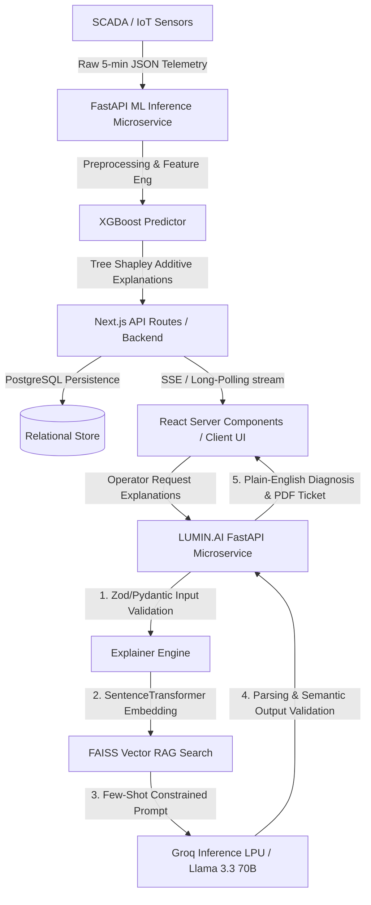

# LUMIN.AI — Comprehensive System Architecture Report
> **An End-to-End Real-Time ML & GenAI Platform for Solar Plant Inverter Risk Assessment and Diagnostics**

Built for **HACKaMINeD 2026**

---

## 1. Abstract
The transition to renewable energy heavily relies on the operational efficiency of photovoltaic (PV) solar power plants, where inverters act as the critical power conversion nodes determining overall yield. Traditional Supervisory Control and Data Acquisition (SCADA) monitoring systems provide high-velocity raw telemetric data, leaving human operators overwhelmed by cascading alarm floods and discrete multi-dimensional sensory outputs during critical hardware failures. This project introduces a fully integrated, state-of-the-art diagnostic ecosystem combining a real-time, high-performance Next.js IoT monitoring frontend, a highly optimized **XGBoost Machine Learning Pipeline** for temporal predictive maintenance, and a transparent, agentic Generative AI explanation layer. The system seamlessly ingests high-frequency sensory streams (5-minute resolution), predicts impending failure risks up to 7 days in advance using strictly chronological Walk-Forward Cross Validation and SHAP (SHapley Additive exPlanations) for inferential interpretability. LUMIN.AI autonomously transforms these complex, multi-variable numerical log-odds anomalies into actionable, professional A4 maintenance reporting and conversational insights. Driven by a rigorously benchmarked LLM (Llama 3.3 70B Versatile via Groq's LPU inference engine), the GenAI pipeline is protected by a deterministic 4-layer hallucination guardrail architecture and comprehensive LangSmith trace observability.

## 2. Technical Introduction
Managing utility-scale PV plants involves monitoring thousands of clustered inverters simultaneously. When an inverter experiences insulated gate bipolar transistor (IGBT) degradation or thermal runaway, operators face a race against time to minimize generation loss. Our platform solves this entire telemetry-to-action pipeline through three decoupled yet highly synergistic subsystems:
- **The Inference Engine (ML Pipeline):** An advanced temporal feature engineering and supervised machine learning module utilizing Optuna-tuned extreme gradient boosting (XGBoost) combined with an unsupervised Isolation Forest for novelty detection, classifying exact risk taxonomies (No Risk, Degradation Risk, Shutdown Risk).
- **The Explanation Layer (GenAI Backend):** A FastAPI-driven LUMIN.AI microservice that intercepts XGBoost's SHAP values and raw multiplexed sensor data, applying Retrieval-Augmented Generation (RAG) against embedded technical manuals to produce plain-English diagnostics, automated PDF maintenance tickets, and a stateful conversational interface.
- **The Operational Hub (Next.js Application):** A robust multi-tenant hierarchy system featuring granular Role-Based Access Control (RBAC), managing real-time websocket/SSE data ingestion, alert state transitions, and responsive UI telemetry rendering.

## 3. Detailed Problem Statement
Modern utility-scale solar operators face three distinct technical hurdles:
1. **High-Velocity Data Overload & Alarm Fatigue:** SCADA systems continuously push hundreds of discrete metrics (DC voltage, string current, internal temperatures across primary/secondary MPPTs) at high frequencies. Detecting subtle degradation vectors against routine diurnal operational cycles is mathematically challenging, often leading to missed pre-fault signatures.
2. **The "Black Box" Opacity of Ensemble AI:** While tree-based ensembles and deep LSTM networks offer high predictive macro-F1 scores, they act as opaque black boxes. Providing a raw percentage risk (e.g., "90% failure probability") without feature attribution leads to operational distrust, rendering the AI effectively useless in a high-stakes industrial setting.
3. **The Semantic Translation Gap:** Even when an ML model successfully outputs local feature importances via Game Theory matrices (e.g., "SHAP marginal contribution for `inverters[0].temp` is +0.35 log-odds"), field technicians lack the context to operationalize this data science output. They require context-aware, deterministic maintenance workflows grounded strictly in OEM technical documentation.

## 4. Proposed Solution & System Architecture
We propose an end-to-end, multi-layered, service-oriented architecture (SOA) that captures high-frequency sensor data, processes it through an explainable AI model with 7-day lookahead temporal forecasting, and translates the findings via an agentic GenAI pipeline explicitly engineered for zero ungrounded hallucinations.

### 4.1. Core Workflow Execution
1. **Sensory Ingestion:** Physical IoT data loggers stream raw telemetry payloads representing inverter operational states at 5-minute polling intervals (288 samples/day/inverter).
2. **ML Pipeline Orchestration:** The backend dynamically preprocesses arrays, engineers rolling temporal momentum matrices, and executes inference via an XGBoost classifier. SHAP values are simultaneously computed to isolate the precise non-linear variables forcing the classification boundaries.
3. **Frontend Telemetry & Routing:** The Next.js API layer ingests the inference payload, executing CRUD persistence to a relational database, and immediately distributing real-time state mutations to active Operator Dashboard clients via Server-Sent Events (SSE).
4. **LLM Interception (LUMIN.AI):** Upon operator interaction with a flagged anomaly, the GenAI microservice intercepts the inference tuple `{risk_score, raw_features, shap_values}`. It triggers a cosine-similarity FAISS vector search semantic retrieval (RAG) against the inverter's chunked OEM manual, compiling a heavily constrained prompt.
5. **Autonomic Agentic Resolution:** The system autonomously commands the LLM to generate a deterministic JSON response, which is serialized into a professional PDF maintenance work order, complete with root-cause isolation, estimated MTTR (Mean Time to Repair), and component requisitions.

### 4.2. Topologies & Data Flow Diagram

### 4.3. Machine Learning Pipeline Deep-Dive
The predictive module is mathematically optimized for time-series hardware degradation detection.

**Algorithm Selection (XGBoost):**
We selected Extreme Gradient Boosting (XGBoost) over Recurrent Neural Networks (LSTMs) or standard Random Forests. XGBoost natively handles tabular IoT matrices, implicitly handles sparse missing values, and provides mathematically rigorous integration with exact TreeSHAP algorithms for sub-millisecond local explainability.

**Pipeline Stages:**
1. **Temporal Feature Engineering:** Raw telemetry is expanded into deep predictive signaling. The pipeline computes rolling statistical windows (Mean, Min, Max, Standard Deviation) over 1h, 6h, and 24h horizons to capture momentum gradients. Deltas (first-order derivatives) compute sudden operational jumps (e.g., day-to-day power differences, voltage phase anomalies).
2. **Deterministic Auto-Labeling:** Due to sparse ground-truth hardware logs, the system employs domain heuristic labeling to assign risk categories (0 = `no_risk`, 1 = `degradation_risk`, 2 = `shutdown_risk`). A 7-day forward-rolling lookahead window (2016 contiguous samples) applies criteria such as `POWER_DROP_THRESHOLD > 30%` and `ALARM_DURATION_THRESH >= 6` to accurately label pre-fault conditions.
3. **Novelty Detection (Ensemble Stacking):** An unsupervised `IsolationForest` is fitted on aggregated metrics (e.g., power z-scores, thermal deviations) to generate global bounds. Flagged boundary anomalies are concatenated as supplementary boolean features into the supervised XGBoost model space.
4. **Chronological Walk-Forward CV & High-Dimensional SMOTE:** Time-series causality is strictly maintained. The last 20% of temporal data acts as an absolute hold-out test set. To combat catastrophic class imbalance (failures represent < 3% of states), Synthetic Minority Over-sampling Technique (SMOTE, `K_NEIGHBORS=5`) computes Euclidean paths between scarce failure points, synthesizing realistic gradient interpolations. Walk-forward folds guarantee zero future-data leakage.
5. **Hyperparameter Distillation (Optuna):** The multi-class XGBoost classifier optimizes macro-F1 across 40 Bayesian trials. The hyper-dimensional search space modulates `max_depth` (3-10), `learning_rate` (0.01-0.3), `reg_alpha` (L1), and `reg_lambda` (L2) to aggressively constrain overfitting on noisy IoT nodes.
6. **Interpretability (SHAP):** Resolves the black-box dilemma by calculating Shapley coefficients based on cooperative game theory, quantifying the precise marginal log-odds contribution of every node's feature split toward the final predicted class probability vector.

### 4.4. The GenAI Explanation Layer (LUMIN.AI)
LUMIN.AI transforms impenetrable matrices into actionable operational mandates.

#### 4-Layer Hallucination Guardrail Architecture
In critical industrial SCADA, Large Language Model hallucinations (e.g., fabricating non-existent thermal limits or phantom error codes) are catastrophic liabilities. We enforce a zero-tolerance 4-layer validation strategy:
1. **Input Schema Validation:** Pydantic models strictly filter injected SHAP features against a serialized canonical dataset schema, discarding phantom keys instantly.
2. **Contextual Prompt Constraints:** System directives enforce rigid epistemological bounds: *"STRICT RULES: 1. ONLY reference data values explicitly provided. 2. NEVER fabricate sensor readings. 3. If data is insufficient, state 'Insufficient Data'."*
3. **Semantic Output Cross-Referencing:** The LLM is forced to output deterministic JSON formatting. A programmatic subroutine iterates through the `key_factors` array, verifying that *every single cited variable* maps explicitly back to the original SHAP input tensor. Violations trigger downstream fallback mechanisms.
4. **Legal & Operational Disclaimer:** All responses inject a hardcoded notification confirming that telemetry data is unaltered and AI-generated text is bounded.

#### Vector Retrieval-Augmented Generation (RAG) Dynamics
To ground the LLM in domain-specific technical reality:
- **Embedding:** Inverter OEM manuals (typically 30+ MB PDFs) are parsed via `PyMuPDF` and chunked using a contiguous 800-word sliding window (200-word overlap) to preserve semantic contexts.
- **Vectorization:** Dense vector representations are computed using the `all-MiniLM-L6-v2` SentenceTransformer architecture.
- **Indexing:** Vectors are localized in a high-speed disk-cached FAISS (Facebook AI Similarity Search) index. Operations compute exact cosine similarities against user query vectors to inject the top-K relevant procedural excerpts directly into the LLM context manifold.

#### Multi-Model Ablation Study & Execution Inference
A rigorous 27-test-case ablation matrices automatically evaluated three hyper-scale LLMs against production workloads, utilizing 5 weighted metrics (JSON Validity [25%], Hallucination Prevention [25%], Technical Completeness [25%], Response Quality [15%], Urgency Accuracy [10%]):
- **Groq (Llama 3.3 70B Versatile):** Achieved **Rank 1** with an aggregate score of 91.7%. Hosted on specialized LPU (Language Processing Unit) hardware, it delivered an unprecedented average latency of **1.0 second**. It maintained a 100% JSON validity execution and 100% hallucination prevention trace history.
- **HuggingFace (Qwen 2.5 72B Instruct):** Achieved equivalent quality logic (91.7%), but failed operational SLA constraints with a drastically inferior average latency of **21.2 seconds**.
- **Google (Gemini 2.5 Flash):** Underperformed relative to the cohort with an aggregate score of 79.4%, suffering specifically in deterministic JSON schema compliance (44% validity rate) and verbose token generation.

#### LangSmith Tracing & Telemetry Observability
System transparency is maintained via an extensive integration with **LangSmith**.
- **Execution Tracing:** Every operational turn automatically logs total prompt tokens, completion tokens, execution latency, exact context injection boundaries, and intermediate LLM outputs prior to guardrail masking.
- **Analytics Dashboard:** Admins can view analytical aggregations embedded via an iframe or direct application views (`langsmith_dashboard.html`). Metrics such as latency frontiers, token expenditure splits (e.g., Groq's highly efficient 248 token/response avg), and programmatic success rates are instantly visible for continuous auditing.

### 4.5. Next.js Backbone & Subsystem Architecture
The entire interactive frontend and routing ecosystem leverages the sophisticated paradigm of **Next.js** rendering.

**Data Flow & Real-Time Stateful Rendering:**
- **Streaming Pipeline:** An asynchronous polling or Server-Sent Events (SSE) `/api/stream/updates` endpoint maintains a persistent HTTP connection to connected dashboard clients. This allows near-instantaneous DOM repaints when an anomaly is registered, immediately highlighting inverter grid blocks dynamically via Tailwind CSS hex combinations corresponding exactly to AI categorization confidence markers.
- **State Management & Context:** React Server Components (RSC) cleanly separate backend database fetching latency from client-side hydration logic, ensuring a highly performant and SEO-optimized architecture, minimizing payload sizes for low-bandwidth operational environments.
- **Responsive Taxonomy Routing:** Categories execute logic bound to color metrics (A = `#22c55e`, D = `#f97316` + slow pulse animation, E = `#ef4444` + rapid pulse animation + sound interrupt). 

**Multi-Tenant Entity Mapping & Security (RBAC):**
- **Relational Integrity:** Implemented on top of a highly optimized ORM model targeting PostgreSQL, tracking associations through a cascading schema: `Admin -> Plant -> Block -> Inverter -> Reading/Alert`. 
- **Role Permissions Base:** Cryptographically secured JWT authentication endpoints determine dynamic UI mounting. Operators are strictly scoped to isolated inverter nodes (`OperatorPlantAccess` intersections), while Admins leverage overarching platform capabilities including decommission actions, hierarchical modification, and audit log analysis.
- **Asymmetric Extensibility:** Built on standard REST principles ensuring smooth abstraction upgrades, easily transiting toward full event-driven Kafka architectures or scalable microservices deployments as load increases.
