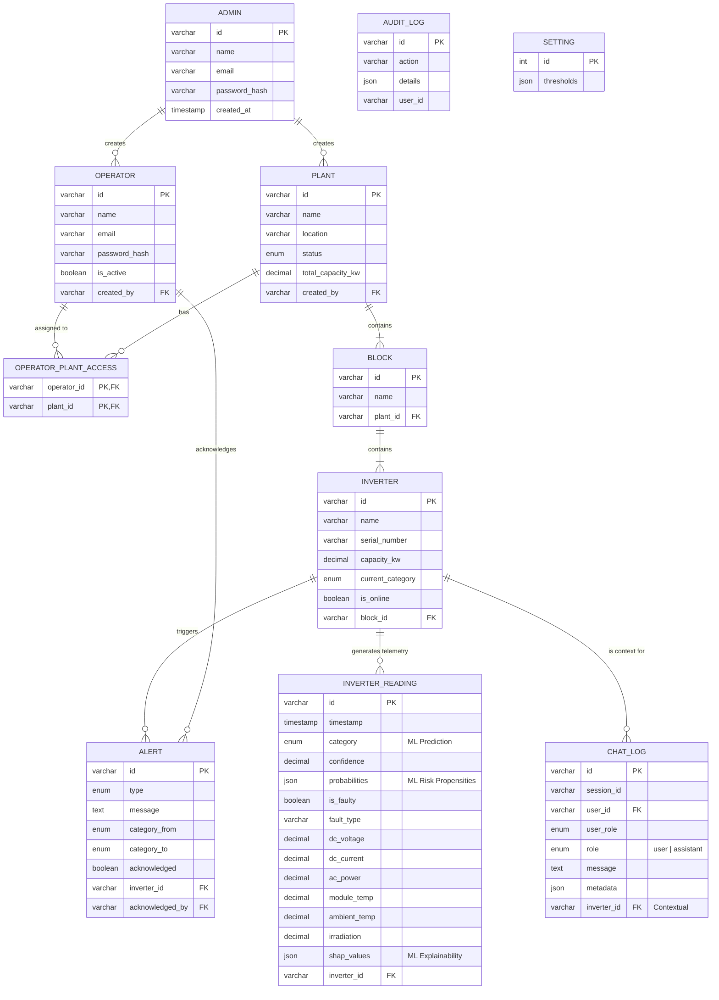

# Lumin AI - Web Platform

Lumin AI is an advanced, AI-powered solar plant monitoring and management platform. It provides real-time telemetry, predictive maintenance insights, and a conversational AI interface for operators to interact with their solar infrastructure data.

## 📁 Directory Structure

The project is structured into two main applications housed within the `nextjs` directory:

```text
nextjs/
├── client/          # Frontend Web Application (React + Vite)
│   ├── public/      # Static assets
│   ├── src/         # Main application source code
│   │   ├── components/ # Reusable UI components
│   │   ├── hooks/      # Custom React hooks
│   │   ├── lib/        # Utility functions and API clients
│   │   └── pages/      # Route-level page components
│   ├── index.html   # Entry point
│   └── package.json # Frontend dependencies
├── server/          # Backend API Server (Node.js + Express)
│   ├── db/          # Database connection and schema definitions
│   ├── middleware/  # Custom Express middlewares (Auth, etc.)
│   ├── routes/      # Express API route handlers
│   ├── simulator/   # Real-time inverter telemetry simulator
│   ├── index.js     # Entry point
│   └── package.json # Backend dependencies
└── README.md        # This documentation file
```

---

## 💻 Frontend Architecture

The frontend is a modern Single Page Application (SPA) designed with a premium, glassmorphic aesthetic focusing on clean data visualization and an intuitive operator dashboard experience.

**Tech Stack:**
* **Framework:** React 18, Vite
* **Routing:** React Router DOM (v6)
* **Styling:** Tailwind CSS, PostCSS, Autoprefixer
* **UI Components:** Shadcn UI (Radix UI primitives built with Tailwind), Vaul
* **Animations:** Framer Motion, GSAP, Anime.js, Tailwindcss-Animate
* **Data Fetching & State:** TanStack React Query (v5)
* **Data Visualization:** Recharts
* **Forms & Validation:** React Hook Form, Zod, Hookform Resolvers
* **Icons:** Lucide React
* **Typography:** Vite plugins for custom fonts (Inter, Montserrat, Bebas Neue)

---

## ⚙️ Backend Architecture

The backend is a robust RESTful API built on Node.js. It handles authentication, data aggregation, real-time telemetry simulation, and acts as the secure gateway to the downstream Generative AI service (FastAPI) for plain-English explanations and maintenance ticket generation.

**Tech Stack:**
* **Runtime:** Node.js
* **Framework:** Express.js
* **Database Driver:** `mysql2` (Promise-based for modern async/await capabilities)
* **Authentication:** JSON Web Tokens (JWT) via `jsonwebtoken`
* **Security & Auth:** `bcryptjs` (Password hashing), `cookie-parser`, `cors`, `express-rate-limit`
* **Validation:** Zod
* **Environment Configuration:** `dotenv`
* **Development:** `nodemon`

---

## 🗄️ Database Schema & Entities

The platform uses a relational MySQL database (`Hackamined_new`) designed to store hierarchical plant assets, high-frequency telemetry readings, AI model predictions, alert histories, and chatbot conversation logs.

### Entity Relationship Diagram



### Table Definitions

* **`admins`**: Top-level administrative users responsible for managing the platform.
* **`operators`**: On-the-ground or control-room personnel. They can access the dashboard and interact with the AI assistant.
* **`plants`**: Represents physical solar farms/installations. Can be linked to an admin creator.
* **`operator_plant_access`**: Many-to-many lookup table dictating which operators are authorized to view which plants (multi-tenant access control).
* **`blocks`**: Logical groupings or physical zones within a single power plant.
* **`inverters`**: The physical inverter devices connected to a block. Maintains the current health state (`current_category`).
* **`inverter_readings`**: High-volume telemetry data. Stores physical sensor data (DC voltage, AC power, irradiation, etc.) alongside the latest **Machine Learning output** (`category`, `confidence`, `{no_risk, degradation_risk, shutdown_risk}` propensities, and `shap_values` array).
* **`alerts`**: System-generated alerts when inverters degrade or fault. Operators can acknowledge these.
* **`chat_logs`**: Complete history of user interactions with the GenAI assistant, preserving conversational memory grouped by `session_id`.
* **`audit_logs`**: Immutable ledger of critical actions taken by users (e.g., acknowledging alerts).
* **`settings`**: Global platform configuration variables like stale device timeouts and ML risk thresholds.
